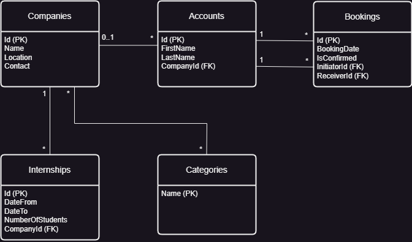

## Backend for SpindlAPL

### Overview
SpindlAPL is a CRM-system with a large company register that allows companies to create and view bookings between various users, and also other non-company users to view their bookings.
The booking functionality is the core part of the application. The backend is built with ASP.NET Core, Entity Framework Core for ORM, and Identity for managing users.
Authentication is done using cookies and authorization is role-based.
<br><br>
The project uses design patterns with Services, Repositories and Unit of Work for all entities except for handling users/accounts. 
Everything that has to do with users is handled with the built-in UserManager, SignInManager and RoleManager classes in Identity, the only exception being to check if a user is already authenticated (using claims instead).

### Table of Contents

1. [Features](#features)
2. [Technologies Used](#technologies-used)
3. [Setup and Installation](#setup-and-installation)
4. [Database Schema](#database-schema)
5. [Usage](#usage)
6. [Generating the UML Diagram](#generating-the-uml-diagram)

### Features

### Technologies Used
- .NET version 8.0
- ASP.NET Core
- Entity Framework Core
- SQL Server
- Identity
- Cookies
- Role-based authorization

### Setup and Installation

1. Clone the repository:
   ```bash
   git clone https://github.com/MinaStormcloud/Spindl_APL.git
   cd Spindl_APL.Server

2. In Visual Studio, ensure that "Allow NuGet to download missing packages" is checked in Tools > Options > NuGet Package Manager > General.

3. To use Code First, just ensure you don't have a database called SpindlAPL. Otherwise, either change the database name in appsettings.json or use a different connection string. 

4. Apply migrations to set up the database:
    ```bash
    dotnet ef database update
    
5. Run the project:
   ```bash
   dotnet run
   
### Database Schema

The UML diagram of the database shows everything in the database except for the inherited and otherwise built-in tables and fields from Identity. The Accounts table is an extension of AspNetUsers.
<br><br>



### Usage

### Generating the UML Diagram

The UML diagram is generated with Draw.io, and the .io file is versioned in this repo (UML-Db.drawio).
